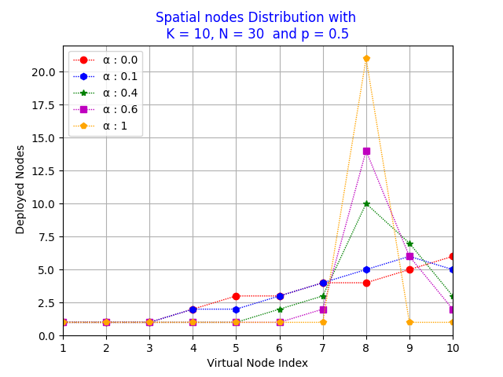

# Sensor Deployment in LWSN ✨
This code allows you to <strong>determine the number n</strong> of sensors required for each virtual node <strong>K</strong>.<br/>
<strong>Virtual Node</strong>  concept in <em>Linear Wireless Sensors Networks (LWSN)</em> is proposed by <strong>[Dr DOMGA Rodrige K.](https://cm.linkedin.com/in/rodrigue-domga-komguem-phd-311b2a20)</strong>
in his [thesis](https://tel.archives-ouvertes.fr/tel-03088530v2/document)



[  ](https://github.com/NanfackSteve/Sensors_Deployment_in_LWSN/actions/workflows/c-actions-CI.yml)

## Pre-requisites

### [For Python Version](./python_version/) 

```
pip install matplotlib
```

### [For C Version](./c_version/) 

```
sudo apt install plotutils gnuplot-x11
```

## How To use ?

[For Python Version](./python_version/) run this command
```
python3 Sequential_deploy
```

[For C Version](./c_version/) run `make ` command
```
make all
```
