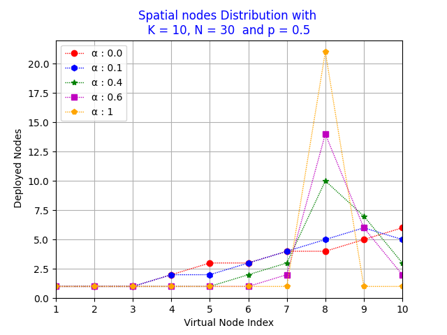

# Sensor_Deployment_in_LWSN :coffee:
This code allow you to deploy sensors in Linear Wireless Sensors Networks  
using <strong>Virtual Node</strong> concept proposed by <strong>[Dr DOMGA Rodrige K.](https://cm.linkedin.com/in/rodrigue-domga-komguem-phd-311b2a20)</strong>  
in his [thesis](https://tel.archives-ouvertes.fr/tel-03088530v2/document)

## Pre-requisites
<ul>
  <li> import <strong>matplotlib</strong> module (pip install matplotlib)</li>
</ul>
