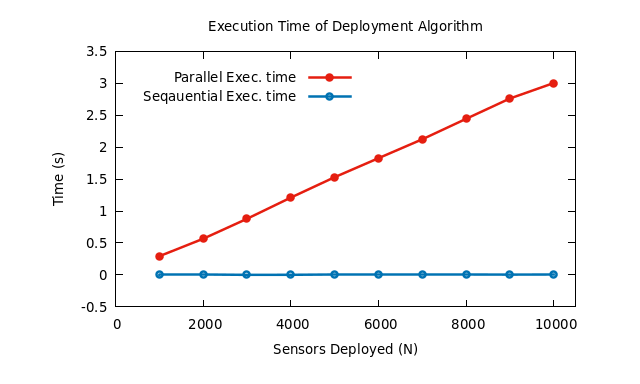

# This version has parallel and sequential code

The purpose of this version is to <b>compare the execution time</b> of sequential and parallel code. 



<br/><em>parallel_datas</em> and <em>sequential_datas</em> <b>folders</b> will contains datas of each deployment (with specific parameters <b>N, K , λ, α, p</b>).

## How to use ?

To run all automatically just run `make all` command.

<ul>
    <li>For parallel_deploy.exe program, use like this:</li>
</ul>

`parallel_deploy.exe N K λ α p Thread_number deployment_number`

```
./parallel_deploy.exe 30 10 1 0.4 0.5 4 3
```

<ul>
    <li>For sequential_deploy.exe program, use like this :</li>
</ul>

`sequential_deploy.exe N K λ α p deployment_number`

```
./sequential_deploy.exe 30 10 1 0.4 0.5 7
```
